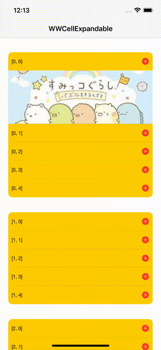
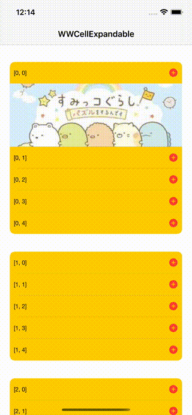
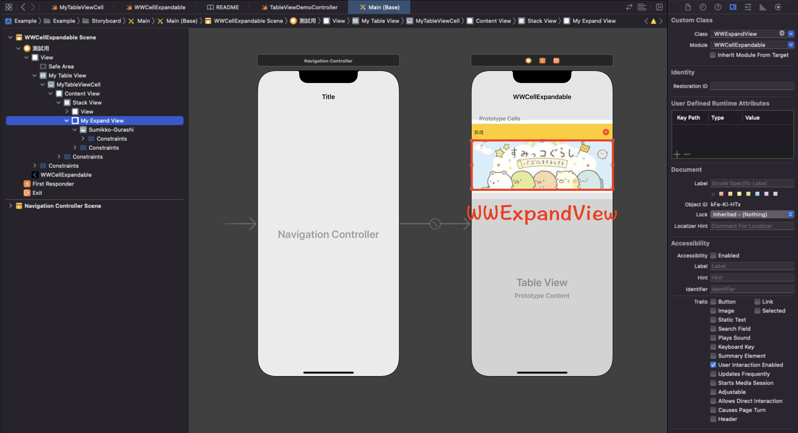

# WWExpandableCell

[](https://developer.apple.com/swift/) [](https://developer.apple.com/swift/)  [](https://developer.apple.com/swift/) [](https://developer.apple.com/swift/)

## [Introduction - 簡介](https://swiftpackageindex.com/William-Weng)

Using Protocol to set, the expand/collapse function can be easily realized without affecting the native UITableViewCell function.

使用Protocol來設定，在不影響原生的UITableViewCell功能之下，能簡單的實現展開 / 折疊的功能。

## Achievements display - 成果展示
 

## [Installation with Swift Package Manager - 安裝方式](https://medium.com/彼得潘的-swift-ios-app-開發問題解答集/使用-spm-安裝第三方套件-xcode-11-新功能-2c4ffcf85b4b)

```bash
dependencies: [
    .package(url: "https://github.com/William-Weng/WWExpandableCell.git", .upToNextMajor(from: "1.0.0"))
]
```

## Usage - 使用方式

The part to be collapsed, use WWExpandView type.

將要折疊的部分，使用WWExpandView類型。



## Example - 程式範例
```swift
import UIKit

final class TableViewDemoController: UIViewController {

    @IBOutlet weak var myTableView: UITableView!
    
    override func viewDidLoad() {
        super.viewDidLoad()
        initSetting()
    }
    
    deinit {
        MyTableViewCell.myTableView = nil
    }
}

// MARK: - UITableViewDelegate, UITableViewDataSource
extension TableViewDemoController: UITableViewDelegate, UITableViewDataSource {
    
    func numberOfSections(in tableView: UITableView) -> Int { return 3 }
    func tableView(_ tableView: UITableView, numberOfRowsInSection section: Int) -> Int { return 5 }
    func tableView(_ tableView: UITableView, cellForRowAt indexPath: IndexPath) -> UITableViewCell { return cellMaker(tableView, cellForRowAt: indexPath)! }
}

// MARK: - 小工具
private extension TableViewDemoController {
    
    /// 初始化設定
    func initSetting() {
        
        myTableView.delegate = self
        myTableView.dataSource = self
        
        MyTableViewCell.myTableView = myTableView
        MyTableViewCell.expandedCell(section: 0, row: 0)
    }
    
    /// Cell產生器
    /// - Parameters:
    ///   - tableView: UITableView
    ///   - indexPath: IndexPath
    /// - Returns: MyTableViewCell
    func cellMaker(_ tableView: UITableView, cellForRowAt indexPath: IndexPath) -> MyTableViewCell? {
        
        let cell = tableView.dequeueReusableCell(withIdentifier: "MyTableViewCell", for: indexPath) as? MyTableViewCell
        cell?.configure(with: indexPath)
        
        return cell
    }
}

```

```swift
import UIKit
import WWExpandableCell

final class MyTableViewCell: UITableViewCell {
    
    @IBOutlet weak var myExpandView: WWExpandView!
    @IBOutlet weak var myLabel: UILabel!
    
    static weak var myTableView: UITableView?
    static var expandRowsList: [Int: Set<IndexPath>] = [:]
    
    var indexPath: IndexPath = []
    
    private let isSingle = true
    
    /// 展開 / 折疊
    /// - Parameter sender: UIButton
    @IBAction func expandAction(_ sender: UIButton) {
        guard let myTableView = Self.myTableView else { return }
        MyTableViewCell.exchangeExpandState(myTableView, indexPath: indexPath, isSingle: isSingle)
    }
}

// MARK: - WWCellExpandable
extension MyTableViewCell: WWCellExpandable {    
    
    func configure(with indexPath: IndexPath) {
        self.indexPath = indexPath
        myExpandView.isHidden = !(Self.expandRowsList[indexPath.section]?.contains(indexPath) ?? false)
        myLabel.text = "\(indexPath)"
    }
    
    func expandView() -> WWExpandView? { return myExpandView }
}
```
